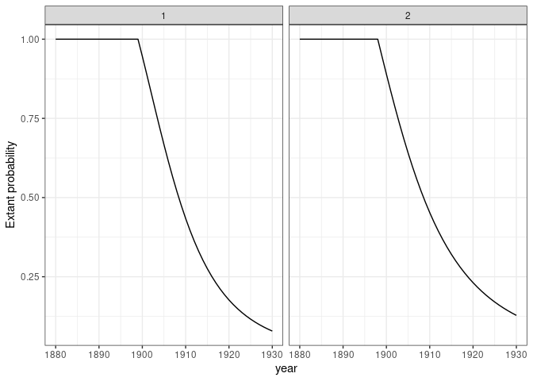
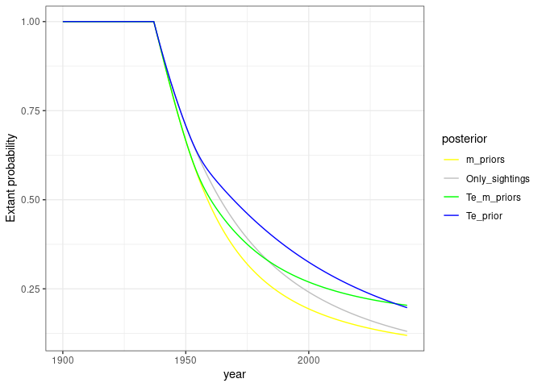

<!-- README.md is generated from README.Rmd. Please edit that file -->

# SpaColExt

<!-- badges: start -->
<!-- badges: end -->

The goal of SpaColExt R package is to infer spatial colonization and
extinction dates of species accounting for the spatial heterogeneity of
the data. It uses a Bayesian approach to estimate the probability of
species still extant through the time a different spatial level.

We use the Bayesian functions from [Solow
1993](https://www.jstor.org/stable/1940821?seq=1) and we will also add
the [Solow & Beet
2014](https://www.researchgate.net/publication/262387815_On_Uncertain_Sightings_and_Inference_about_Extinction)
functions to incorporate the certainty and uncertainty of the data.

## Installation

You can install the development version of SpaColExt from
[GitHub](https://github.com/) with:

``` r
# install.packages("devtools")
devtools::install_github("Clara-Casabona/SpaColExt")
```

## Some notes:

This package is in development. I need to:

-   Add spatial prior information

## Example 1

This is a basic example which shows you how to estimate the posterior
distribution of the extant probability of a extinct species:

``` r
library(SpaColExt)

## basic example code
sightings = c(1901,1902,1903,1905,1908,1910)
start_year = 1900
end_year = 1920
dprior_m = function(m) 1 / m
dprior_te = function(te) 1
prior =0.5

compute_posterior_solow1993(sightings = sightings, 
                            start_year = start_year,
                            end_year = end_year, 
                            dprior_m = dprior_m ,
                            dprior_te = dprior_te,
                            prior = prior)
#> [1] 0.1388889
```

## Example 2

This is a basic example which shows you how to estimate the posterior
distribution of the extant probability of a extinct species in different
sites:

``` r
library(SpaColExt)

## Creating data in a matrix 2x2
data = list(c(1880, 1883, 1895, 1897, 1899), NA, NA, c(1882, 1884, 1896, 1898))
dim(data) <- c(2, 2)

## Using Solow 1993 priors
dprior_m = function(m) 1 / m
dprior_te = function(te) 1
prior =0.5

## Study interval
start_year = 1880
stop_year = 1930


# Estimating extant probabilities

extant_probability = Spatial_posterior_probability_extinction_varying_end_year(data, 
                                                                               start_year=start_year,
                                                                               stop_year=stop_year)
## Output of one of the sites:

extant_probability[1,1]
#> [[1]]
#>  [1] 1.00000000 1.00000000 1.00000000 1.00000000 1.00000000 1.00000000
#>  [7] 1.00000000 1.00000000 1.00000000 1.00000000 1.00000000 1.00000000
#> [13] 1.00000000 1.00000000 1.00000000 1.00000000 1.00000000 1.00000000
#> [19] 1.00000000 1.00000000 0.94613250 0.89040796 0.83376225 0.77710330
#> [25] 0.72126176 0.66695497 0.61476592 0.56513632 0.51837127 0.47465226
#> [31] 0.43405500 0.39656930 0.36211871 0.33057853 0.30179141 0.27558009
#> [37] 0.25175760 0.23013486 0.21052632 0.19275375 0.17664878 0.16205431
#> [43] 0.14882522 0.13682842 0.12594264 0.11605784 0.10707460 0.09890328
#> [49] 0.09146330 0.08468226 0.07849524

# Ploting the exant probability

Plot_posterior_distribution(extant_probability, start_year=start_year, stop_year=stop_year)
```



With this example we estimate the probability that the species is extant
in different sites considering that the observations are independent
between the sites.

## Example 3 (In development)

This example will show you how to estimate the posterior distribution of
the extant probability of an extinct species in different sites,
assuming that the observations in one site are influenced by the
observations in neighbours sites:

``` r
library(SpaColExt)
library(dplyr)
#> 
#> Attaching package: 'dplyr'
#> The following objects are masked from 'package:stats':
#> 
#>     filter, lag
#> The following objects are masked from 'package:base':
#> 
#>     intersect, setdiff, setequal, union
library(ggplot2)
library(ggpubr)
set.seed(12)

# Create a realistic data set of observations 
n = 40 # number of years with observational data
t_ext = 1940 # True extinction time
t_start = t_ext - n #Year of the possible first observation
t_stop = 2040 # End of the study period
m_rate = 2 # mean time between sighting before extinction

generate_data = function(t_start, t_ext, m_rate) {
  sightings = t_start + unique(floor(cumsum(rexp(2*(t_ext-t_start)/m_rate, 1/m_rate))))
  sightings[sightings<=t_ext]
}

sightings = generate_data(t_start, t_ext, m_rate) # Simulated sighting used to predict extinction in a specific place

sightings2 = generate_data(t_start, t_ext+10, 1)  # Simulated sighting list to estimate the first posterior distribution of extinction date 


posterior = compute_posterior_c2022_extinction(sightings2, t_start, t_stop)

prior_te = approxfun(t_start:t_stop, 1-posterior) # IMPORTANT! The scaling still in progress! This might be modified in the next weeks. 

prior_m = Vectorize(function(m) {
  if(m > 10*m_rate) return(1e-6)
  m_rate**m * exp(-m_rate) / gamma(m+1)
})

vizualize_priors_effects(t_start, t_stop, sightings, prior_te = prior_te, prior_m = prior_m)
#> Joining, by = "year"
#> Joining, by = "year"
#> Joining, by = "year"
```


