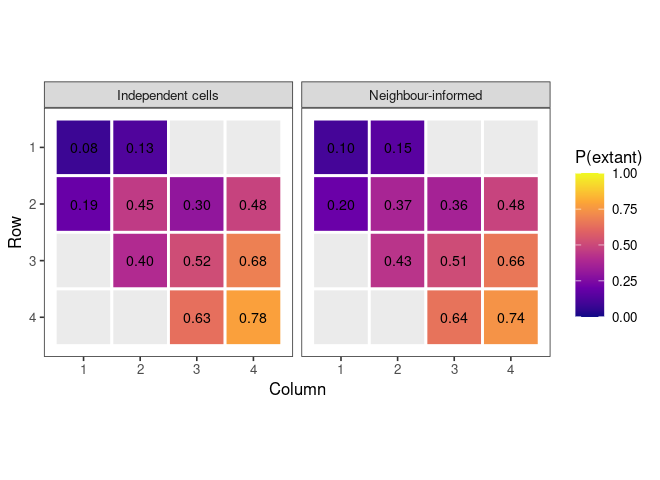
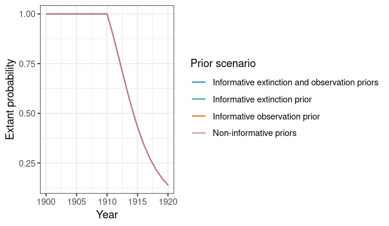

<!-- README.md is generated from README.Rmd. Please edit that file. -->


# SpaColExt

<!-- badges: start -->
[](https://github.com/Clara-Casabona/SpaColExt/actions/workflows/R-CMD-check.yaml)
[](https://lifecycle.r-lib.org/articles/stages.html#experimental)
[](LICENSE.md)
<!-- badges: end -->

SpaColExt is an R package for inferring extinction and colonization dates from species sighting records. It focuses on Bayesian extinction inference through time and across spatial units, with tools for:

- estimating posterior extant probabilities from sighting years;
- applying Solow-style Bayesian extinction estimators;
- evaluating posterior probabilities over a sequence of possible end years;
- applying the same workflow independently across spatial cells;
- exploring informative priors for extinction time and observation rate.

The package currently implements methods based on Solow (1993), with experimental non-homogeneous observation-rate functions inspired by Kodikara et al. (2020). Solow and Beet (2014)-style uncertain sighting support is planned but not yet part of the stable workflow.

## Installation

You can install the development version from GitHub:

``` r
# install.packages("remotes")
remotes::install_github("Clara-Casabona/SpaColExt")
```

Load the package with:

``` r
library(SpaColExt)
```

## Basic Workflow

The main input is a numeric vector of sighting years. In the simplest case, `compute_posterior_solow1993()` returns the posterior probability that the species is still extant at the end of the study interval.


``` r
sightings <- c(1901, 1902, 1903, 1905, 1908, 1910)
start_year <- 1900
end_year <- 1920

compute_posterior_solow1993(
  sightings = sightings,
  start_year = start_year,
  end_year = end_year,
  dprior_m = solowdprior_m,
  dprior_te = solowdprior_te,
  prior = 0.5
)
#> [1] 0.1388889
```

## Posterior Probability Through Time

Use `posterior_probability_extinction_varying_end_year()` to evaluate the posterior extant probability for every year in a study period.


``` r
posterior <- posterior_probability_extinction_varying_end_year(
  sightings = sightings,
  start_year = start_year,
  stop_year = end_year
)

data.frame(
  year = seq(start_year, end_year),
  extant_probability = posterior
)
#>    year extant_probability
#> 1  1900          1.0000000
#> 2  1901          1.0000000
#> 3  1902          1.0000000
#> 4  1903          1.0000000
#> 5  1904          1.0000000
#> 6  1905          1.0000000
#> 7  1906          1.0000000
#> 8  1907          1.0000000
#> 9  1908          1.0000000
#> 10 1909          1.0000000
#> 11 1910          1.0000000
#> 12 1911          0.8911846
#> 13 1912          0.7706155
#> 14 1913          0.6482621
#> 15 1914          0.5331491
#> 16 1915          0.4312668
#> 17 1916          0.3451666
#> 18 1917          0.2747469
#> 19 1918          0.2183818
#> 20 1919          0.1738466
#> 21 1920          0.1388889
```

## Spatial Workflow

Spatial analyses use a matrix-like object where each cell contains a vector of sighting years for one site. Cells with no observations can be set to `NA`.


``` r
sighting_grid <- list(
  c(1880, 1883, 1895, 1897, 1899),
  NA,
  NA,
  c(1882, 1884, 1896, 1898)
)
dim(sighting_grid) <- c(2, 2)

spatial_posterior <- spatial_posterior_probability_extinction_varying_end_year(
  sighting_grid,
  start_year = 1880,
  stop_year = 1930
)

spatial_posterior[1, 1]
#> [[1]]
#>  [1] 1.00000000 1.00000000 1.00000000 1.00000000 1.00000000 1.00000000
#>  [7] 1.00000000 1.00000000 1.00000000 1.00000000 1.00000000 1.00000000
#> [13] 1.00000000 1.00000000 1.00000000 1.00000000 1.00000000 1.00000000
#> [19] 1.00000000 1.00000000 0.94613250 0.89040796 0.83376225 0.77710330
#> [25] 0.72126176 0.66695497 0.61476592 0.56513632 0.51837127 0.47465226
#> [31] 0.43405500 0.39656930 0.36211871 0.33057853 0.30179141 0.27558009
#> [37] 0.25175760 0.23013486 0.21052632 0.19275375 0.17664878 0.16205431
#> [43] 0.14882522 0.13682842 0.12594264 0.11605784 0.10707460 0.09890328
#> [49] 0.09146330 0.08468226 0.07849524

plot_posterior_distribution(
  spatial_posterior,
  start_year = 1880,
  stop_year = 1930
)
```

<div class="figure">

<p class="caption">plot of chunk example-spatial</p>
</div>

## Informative Priors

`compute_posterior_c2022_extinction()` allows custom priors for extinction time (`prior_te`) and observation rate (`prior_m`). This is useful when independent ecological or sampling information should influence the posterior.


``` r
prior_te <- function(te) 1
prior_m <- function(m) 1 / pmax(m, .Machine$double.eps)

compute_posterior_c2022_extinction(
  sightings = sightings,
  start_year = start_year,
  stop_year = end_year,
  prior_te = prior_te,
  prior_m = prior_m
)
#>  [1] 1.0000000 1.0000000 1.0000000 1.0000000 1.0000000 1.0000000 1.0000000
#>  [8] 1.0000000 1.0000000 1.0000000 1.0000000 0.8911846 0.7706155 0.6482621
#> [15] 0.5331491 0.4312668 0.3451666 0.2747469 0.2183818 0.1738466 0.1388889
```

You can also compare the effect of different prior combinations:


``` r
visualize_priors_effects(
  t_start = start_year,
  t_stop = end_year,
  sightings = sightings,
  prior_te = prior_te,
  prior_m = prior_m
)
```

<div class="figure">

<p class="caption">plot of chunk example-prior-plot</p>
</div>

## Function Overview

- `compute_posterior_solow1993()`: posterior extant probability for one study interval.
- `posterior_probability_extinction_varying_end_year()`: posterior extant probabilities for a sequence of end years.
- `spatial_posterior_probability_extinction_varying_end_year()`: applies the varying end-year workflow across spatial cells.
- `plot_posterior_distribution()`: plots posterior extant probabilities through time.
- `compute_posterior_c2022_extinction()`: posterior curve with optional informative priors.
- `transform_and_reverse()`: helper for reversing sighting dates for colonization-oriented workflows.

Experimental non-homogeneous functions are available, but their interface and numerical behavior may still change.

## Development Status

SpaColExt is under active development. The current maintenance priorities are:

- add stable support for colonization-date inference;
- formalize spatial dependence between neighbouring sites;
- add support for uncertain sightings;
- expand tests around the non-homogeneous observation-rate functions;
- improve method references and vignettes for applied ecological workflows.

## References

Solow, A. R. (1993). Inferring extinction from sighting data. *Ecology*, 74(3), 962-964.

Solow, A. R. and Beet, A. R. (2014). On uncertain sightings and inference about extinction. *Conservation Biology*, 28(4), 1119-1123.

Kodikara, S., et al. (2020). Non-homogeneous sighting processes for extinction inference. *Methods in Ecology and Evolution*.
