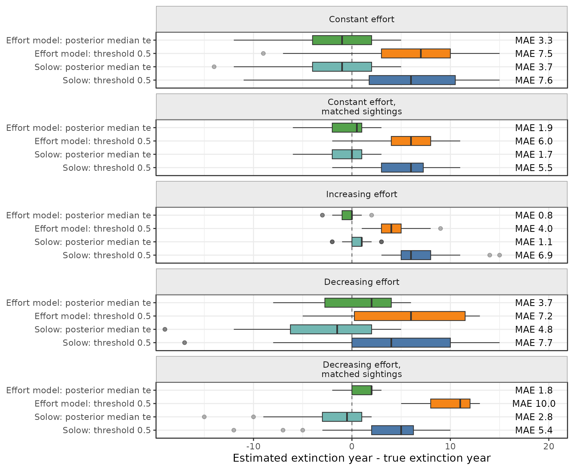

# Simulation Diagnostics

The simulation diagnostics compare model behavior under known extinction and colonization dates. They are meant to answer practical questions:

- Does the effort-informed model improve extinction-date estimation?
- Is the gain caused by the shape of observation effort, or simply by having more sightings?
- What happens when observation effort decreases before extinction?
- Is a threshold rule or a posterior-time estimator better for estimating a date?

## Scripts

The diagnostic scripts live in `analysis/simulation_study/`.

Run from the package root:

```r
source("analysis/simulation_study/diagnose_extinction_improvements.R")
source("analysis/simulation_study/plot_extinction_quantile_comparison.R")
```

The outputs are written to:

```text
analysis/simulation_study/results/
analysis/simulation_study/results/figures/
```

## Date Estimators

The diagnostics compare two ways to convert model output into a single estimated extinction year.

The first is the threshold estimator: the first year where posterior persistence drops below 0.5. This is intuitive, but it can estimate extinction too late when the posterior curve declines slowly.

The second is the posterior-time estimator: the posterior median of extinction time `te`, implemented in `posterior_extinction_year_quantile()`. This directly summarizes the inferred extinction-time distribution.

## Effort Scenarios

The diagnostics include five extinction scenarios:

- constant observation effort;
- constant observation effort with matched expected sightings;
- increasing observation effort;
- decreasing observation effort;
- decreasing observation effort with matched expected sightings.

The matched-sightings scenarios adjust the observation-rate parameter so the expected number of sightings is comparable across effort shapes. This separates the effect of temporal effort shape from the effect of having more or fewer observations.

## Results



Mean absolute errors from the current diagnostic run:

| Scenario | Solow threshold | Solow median `te` | Effort threshold | Effort median `te` |
|---|---:|---:|---:|---:|
| Constant effort | 7.6 | 3.7 | 7.5 | 3.3 |
| Constant effort, matched sightings | 5.4 | 1.7 | 6.0 | 2.0 |
| Increasing effort | 6.9 | 1.1 | 4.0 | 0.8 |
| Decreasing effort | 7.7 | 4.8 | 7.2 | 3.7 |
| Decreasing effort, matched sightings | 5.4 | 2.8 | 10.0 | 1.8 |

The main result is that the posterior median of `te` is usually a better date estimator than the threshold rule. The threshold rule often estimates extinction too late because it waits for the posterior persistence curve to cross an arbitrary decision boundary.

The diagnostics also show that the original comparison between constant and increasing effort is partly confounded by the number of observations. The constant-effort scenario has fewer sightings on average. When the number of expected sightings is matched, the error decreases substantially.

For decreasing effort before extinction (`alpha < 1`), the effort-informed posterior median still improves over the threshold rule, but sparse late observations remain difficult. If effort decreases near the extinction date, missing late sightings are less informative than they would be under constant or increasing effort.

## Interpretation

These simulations suggest that two reporting choices are important:

- report whether an extinction-year estimate comes from a threshold crossing or from a posterior-time summary;
- distinguish temporal effort shape from the total amount of information in the sighting record.

For manuscripts, the posterior median of `te` is a better default extinction-date estimate than the first crossing of posterior persistence below 0.5. The threshold rule can still be useful as a decision-oriented summary, but it should not be treated as the only date estimator.
